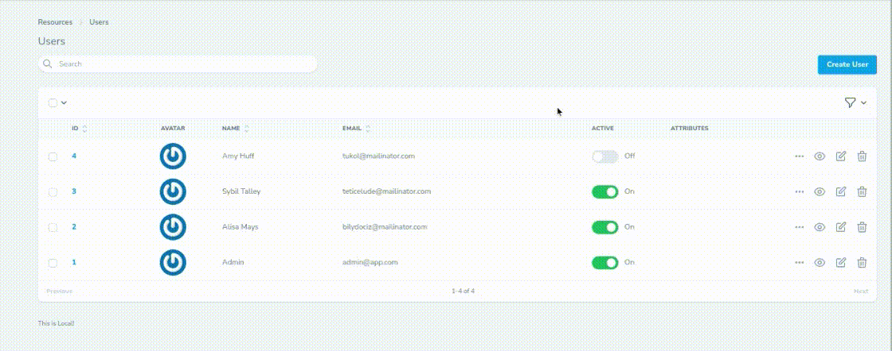

# Laravel Nova Next Input Focus
*Nova Next Input/Field Auto Focus/Move.*

**Sometimes** we have **too many** inputs, and It's hard to keep pressing <kbd>Tab</kbd> to move to next input. **_Right_**?

This package helps you to implement it 👍️.

## Preview


## Dependencies:
* php >=8.1 **REQUIRED IN YOUR PROJECT**
* laravel >=9 **REQUIRED IN YOUR PROJECT**
* nova >=4 **REQUIRED IN YOUR PROJECT** _We didn't try it with nova 3_
* VueJs >=3.2.38 **REQUIRED IN YOUR PROJECT** _We didn't try it with VueJs 2_

## Installation
You can install this package via composer:

```bash
composer require mphpmaster/laravel-nova-next-input-focus
```

> :warning: You need to have [laravel nova](https://nova.laravel.com/) installed!

## Configuration
You may publish the configuration with the following command:

```bash
php artisan vendor:publish --tag=nova-next-input-focus-config
```

## License

The Laravel framework is open-sourced software licensed under the [MIT license](https://opensource.org/licenses/MIT).

These Helpers are open-sourced software licensed under the [MIT license](https://github.com/mPhpMaster/laravel-nova-next-input-focus/blob/master/LICENSE).
